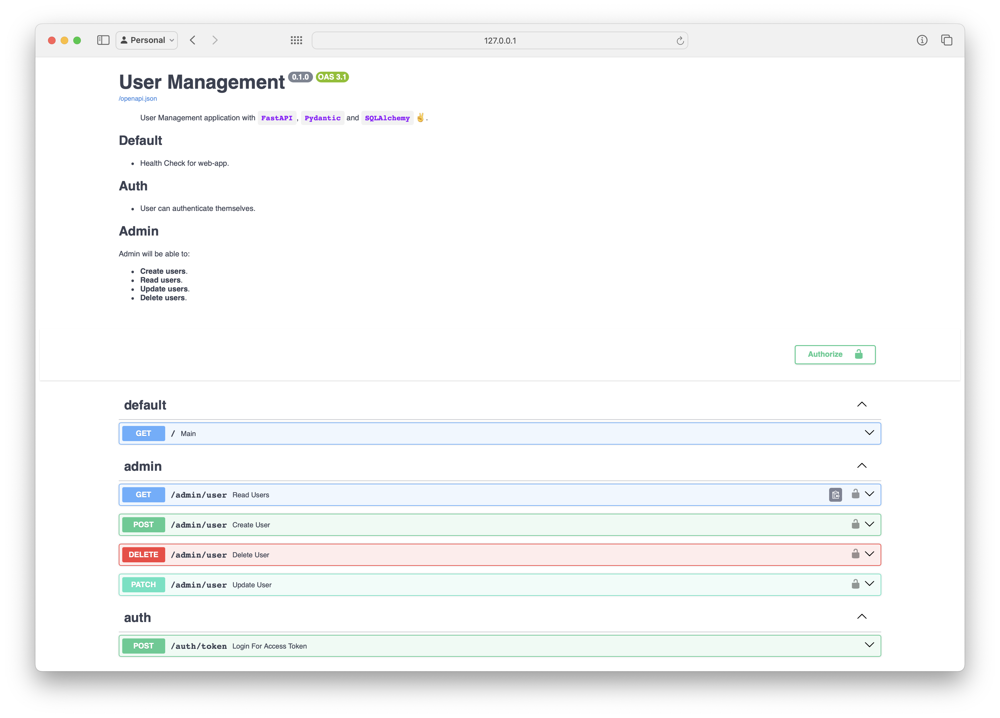
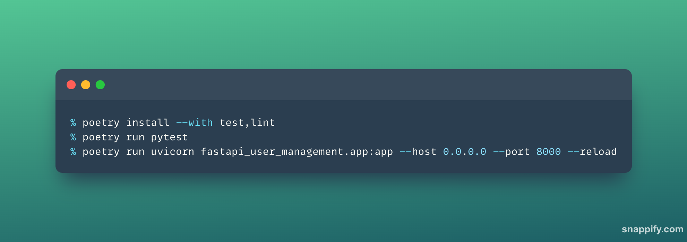

# FastAPI User Management

[![Packaged with Poetry][poetry-badge]](https://python-poetry.org/)

[](https://github.com/astral-sh/ruff)
[](https://docs.pydantic.dev/latest/contributing/#badges)

[poetry-badge]: https://img.shields.io/badge/packaging-poetry-cyan.svg

This project is the most secure BackEnd out there 😂, also it has the cleanest code that ever written. With proper tests that give us 100% coverage of our code. 

---

### Image






### Development

```bash
poetry install --with test,lint

# Run Test
poetry run pytest

# Lint
poetry run pre-commit install
poetry run pre-commit run

# Run Service
poetry run uvicorn fastapi_user_management.app:app --host 0.0.0.0 --port 8000 --reload
```
